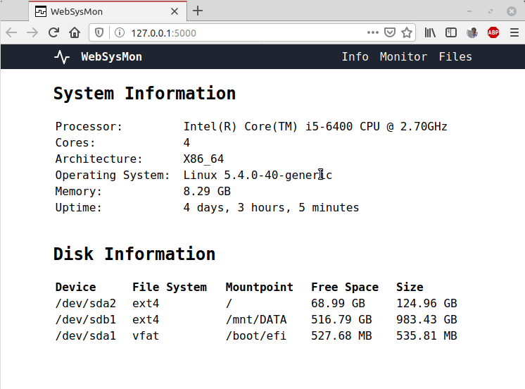

Stands for 'Web System Monitor'. Simple flask based application to monitor a remote computer.
Monitor CPU usage, memory usage, network usage, disk reads/writes
and browse files with WebSysMon.

WebSysMon currently supports Linux only.

Uses [picograph.js](https://github.com/RainingComputers/picograph.js) library to draw graphs.

Uses [Feather icons](https://feathericons.com/) for icons.

# Installation
+ Install pipenv
```
python3 -m pip install pipenv
```
+ Clone the repo using `git clone`
```
git clone https://github.com/RainingComputers/WebSysMon.git
cd WebSysMon
```
+ You may need to install python development headers
```
sudo apt-get install python3-dev
```
+ Create virtual environment and install dependencies
```
pipenv shell
pipenv install
```
# Deploying using Gunicorn
```
pipenv shell
gunicorn -w 4 -b 127.0.0.1:5000 websysmon:app
```


